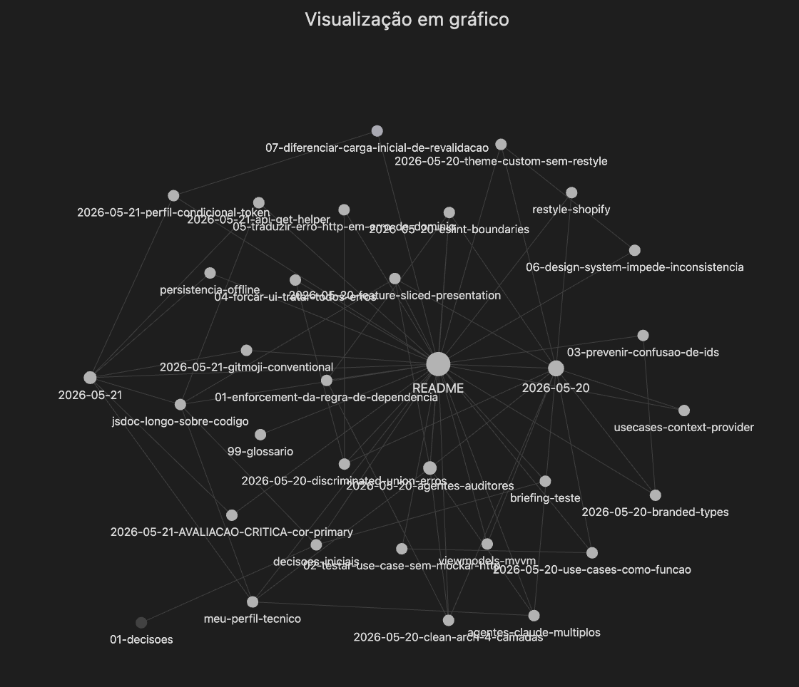

# GitHub Explorer

App React Native (Expo) pra buscar e explorar repositórios públicos do GitHub. Feito como teste técnico de desenvolvedor React Native.

Funcionalidades: busca paginada de repositórios, tela de detalhes, lista de issues abertas, showcase do Design System, modo escuro com toggle (Automático/Escuro/Claro) e tela de perfil do usuário autenticado via token.

---

## Vault de processo

Todo o raciocínio por trás das decisões está documentado num vault Obsidian dentro deste próprio repositório, na pasta [`obsidian-vault/`](./obsidian-vault) — ADRs em formato Michael Nygard, padrões rejeitados, perguntas estratégicas, perfil técnico de calibragem e daily logs dos dois dias de desenvolvimento.



### Como navegar

**Opção 1 — direto pelo GitHub:** os arquivos `.md` são legíveis no próprio repositório. Os `[[wikilinks]]` aparecem como texto puro (limitação do renderizador), mas os caminhos permitem clicar manualmente nas referências.

**Opção 2 — abrindo como Obsidian Vault (recomendado):**

1. Instalar [Obsidian](https://obsidian.md/) (gratuito, multiplataforma)
2. _Open folder as vault_ → apontar pra `obsidian-vault/` deste repo
3. Wikilinks ficam navegáveis, graph view (igual à imagem acima) ativa, busca full-text funciona

### Sequência de leitura sugerida

1. [`obsidian-vault/README.md`](./obsidian-vault/README.md) — mapa de navegação completo
2. [`00-contexto/briefing-teste.md`](./obsidian-vault/00-contexto/briefing-teste.md) — leitura crítica do PDF
3. [`00-contexto/decisoes-iniciais.md`](./obsidian-vault/00-contexto/decisoes-iniciais.md) — padrões arquiteturais adotados, com trade-offs
4. [`00-contexto/meu-perfil-tecnico.md`](./obsidian-vault/00-contexto/meu-perfil-tecnico.md) — repertório e sinais de drift que orientaram revisões do output da IA
5. [`01-decisoes/`](./obsidian-vault/01-decisoes) — 11 ADRs cronológicas + 1 avaliação crítica autoidentificada (⚠️)
6. [`02-prompts-importantes/`](./obsidian-vault/02-prompts-importantes) — 7 perguntas estratégicas focadas em mecanismos de garantia
7. [`03-rejeitado/`](./obsidian-vault/03-rejeitado) — 6 padrões considerados e descartados com justificativa
8. [`04-diario/`](./obsidian-vault/04-diario) — daily logs dos dois dias de desenvolvimento

### Estrutura de pastas

```
obsidian-vault/
├── 00-contexto/                  # briefing + decisões iniciais + perfil técnico (calibragem)
├── 01-decisoes/                  # 11 ADRs (Michael Nygard) + 1 avaliação crítica
├── 02-prompts-importantes/       # 7 perguntas estratégicas que orientaram o projeto
├── 03-rejeitado/                 # 6 padrões considerados e descartados
├── 04-diario/                    # daily logs (2026-05-20, 2026-05-21)
├── 05-revisoes/                  # weekly reviews (vazio — primeiro fim de semana)
├── 99-glossario.md               # vocabulário do projeto
└── README.md                     # mapa de navegação
```

Quatro **agentes-auditores** em [`.claude/agents/`](./.claude/agents) (`architecture-auditor`, `code-style-auditor`, `adr-keeper`, `vault-curator`) complementam o vault — nenhum gera código de produção, todos validam coerência entre código e vault. Documentados como ADR 008 dentro do próprio vault.

---

## Stack

- **Expo SDK 55** + React Native 0.83.6 + React 19.2
- **TypeScript** em modo strict + `noUncheckedIndexedAccess`
- **React Navigation 7** — bottom tabs + native stack
- **TanStack Query 5** — cache, `useInfiniteQuery`, stale-while-revalidate
- **Axios** pra HTTP
- **Reanimated 4** — shimmer animado nos skeletons
- **Jest 29** + jest-expo + React Native Testing Library 13 (79 testes)
- **ESLint 9** (flat config) + Prettier + Husky + Commitlint
- **@expo/vector-icons** (Feather)

---

## Como rodar

```bash
# 1. Instalar
yarn install

# 2. (Recomendado) Configurar token do GitHub
cp .env.example .env
# Edite .env e cole seu token: https://github.com/settings/tokens
# Sem token: 60 req/hora (rate limit anônimo).
# Com token: 5.000 req/hora. Também habilita a aba "Perfil".

# 3. Subir o app
yarn ios        # simulador iOS (precisa Xcode)
yarn android    # emulador Android
yarn start      # Expo Dev Tools (pra escanear QR com Expo Go)

# 4. Validar
yarn test
yarn typecheck
yarn lint
```

---

## Arquitetura

Clean Architecture em 4 camadas, com Feature-Sliced dentro de `presentation/`.

```
src/
├── domain/                # entidades + contratos + erros (zero dependência externa)
│   ├── entities/
│   ├── repositories/
│   ├── errors/
│   └── types.ts           # branded types pros IDs
├── application/
│   └── use-cases/         # SearchRepos, GetRepoDetails, GetRepoIssues, GetAuthenticatedUser
├── infrastructure/
│   ├── http/              # httpClient (axios), apiGet, errorTranslator
│   ├── mappers/           # API GitHub (snake_case) → domain (camelCase)
│   ├── repositories/      # GitHubRepositoryImpl
│   └── di/                # container DI + queryClient
└── presentation/
    ├── theme/             # tokens GitHub-flavored + ThemeContext custom
    ├── components/
    │   └── ds/            # Design System: Text, Button, Input, Card, Badge, Avatar, Skeleton
    ├── features/
    │   ├── search/        # SearchScreen + RepoCard + RepoList + hook
    │   ├── repo-detail/   # RepoDetailScreen + StatCard + skeleton
    │   ├── issues/        # IssuesScreen + IssueItem
    │   ├── profile/       # ProfileScreen (usuário autenticado)
    │   └── settings/      # SettingsScreen + AppearanceScreen
    ├── screens/
    │   └── ShowcaseScreen.tsx
    ├── navigation/        # tab navigator + stacks
    └── providers/         # AppProviders (Query + Theme + SafeArea)
```

### Decisões e trade-offs

**Hooks customizados, não MVVM com ViewModels.** O PDF sugere literal `hooks/useSearchRepos.ts` na seção 3.2. ViewModels separados adicionariam camada que React Hooks já cobrem — mais código pra menos benefício.

**Tema custom (sem Restyle ou outra lib).** Tema é uma feature do app — Context puro com ~120 linhas resolve. Paleta inspirada nas cores reais do github.com (light + dark do Mobile, com background preto puro `#000000`) pra coerência com o domínio.

**Use cases como funções factory.** `createSearchReposUseCase(repo)` retorna closure tipada. Sem `this`, sem boilerplate de classe, DI via parâmetro.

**Container DI como factory function.** `createContainer(repository?)` aceita repositório opcional — útil pra injetar `InMemoryGitHubRepository` em testes integrados ou Storybook sem `jest.mock`.

**Branded types pros IDs** (`RepoId`, `IssueId`, `IssueNumber`, `LabelId`, `OwnerId`, `UserId`). Impede confusão de IDs em compile-time, zero custo runtime.

**Erros como discriminated union + `class extends Error`.** Mantém stack trace (importante pra futuro Sentry/Crashlytics) e habilita exhaustiveness check do TS na UI via `switch (error.kind)`.

**ESLint com boundary rules por camada.** `no-restricted-imports` bloqueia `axios` em `domain/`, `@infrastructure/repositories/*` em `presentation/`, etc — Clean Arch enforçada pelo linter, não só por convenção.

**Tab bar com 3 tabs** (Explorar / Perfil / Ajustes). Perfil só aparece se `EXPO_PUBLIC_GITHUB_TOKEN` está definido — sem token, vira app de 2 tabs.

**`apiGet` helper enxuto sobre o axios.** Centraliza a extração de `.data` e a tipagem do response via generic. Em apps maiores onde trabalho normalmente tenho variantes pra cada verbo (`apiPost`, `apiPatch`, etc.) — aqui só `apiGet` porque o app é read-only, YAGNI.

**Sem `UseCasesContext`.** O container já é singleton no módulo. Screens importam direto via `container.searchReposUseCase`. Pra mockar em testes integrados, `jest.mock('@infrastructure/di/container')`.

**Sem persistência offline (PersistQueryClient + AsyncStorage).** Fora do escopo do PDF. Adicionaria se o app fosse usado offline com frequência.

---

## Uso de IA

Projeto desenvolvido com assistência de **Claude Code (Anthropic)** ao longo de dois dias. Não foi um pedido único de "gera o app" — foi um diálogo iterativo onde toda decisão técnica significativa virou ADR documentada, padrões considerados e descartados viraram notas explícitas, e revisões do output viraram refactor rastreável.

O processo completo está no vault Obsidian que acompanha a entrega (ver [Vault de processo](#vault-de-processo) acima). Esta seção resume como o vault foi usado.

### Estrutura de calibragem antes do código

Antes da primeira linha de implementação, três documentos em `00-contexto/` do vault:

- **`briefing-teste.md`** — leitura crítica do PDF, mapeando cada seção em requisito técnico verificável
- **`decisoes-iniciais.md`** — padrões arquiteturais a aplicar (Clean Arch Uncle Bob 2012, branded types, discriminated union, FSD no presentation, ESLint flat config com boundaries) com referências bibliográficas e trade-offs custo/benefício
- **`meu-perfil-tecnico.md`** — repertório técnico ativo + lista de **sinais de drift** (padrões que NÃO são meu estilo: JSDoc longo, switch+helper quando objeto literal serve, naming Material Design 3, `Array<T>`, ViewModels, `any` em produção)

Os três documentos serviram como âncora. Quando o código gerado parecia "amador" ou genérico, cruzei a lista de sinais de drift com o editor pra identificar exatamente o que precisava mudar.

### Como o vault organizou as decisões

| Artefato                          | Volume    | Conteúdo                                                                                                                                                                                                                                                   |
| --------------------------------- | --------- | ---------------------------------------------------------------------------------------------------------------------------------------------------------------------------------------------------------------------------------------------------------- |
| **ADRs** (formato Michael Nygard) | 11 + ⚠️ 1 | Cada decisão arquitetural relevante: Clean Arch, branded types, error union, FSD, theme custom, ESLint boundaries, agentes auditores, Gitmoji, perfil condicional, apiGet. Mais 1 avaliação crítica autoidentificada — primary verde com semântica de info |
| **Padrões rejeitados**            | 6         | Restyle, ViewModels MVVM, agentes-geradores por área, UseCasesContext, persistência offline, JSDoc longo descrevendo o código                                                                                                                              |
| **Perguntas estratégicas**        | 7         | Perguntas sobre **mecanismos de garantia** (não features) — ex: "como enforçar a Dependency Rule em compile-time?", "como testar use cases sem mockar HTTP?", "como prevenir confusão de IDs em compile-time?"                                             |
| **Daily logs**                    | 2         | Fluxo dos dois dias de desenvolvimento, decisões emergindo conforme o trabalho avançava                                                                                                                                                                    |

Quatro **agentes-auditores** em `.claude/agents/` complementam o vault — nenhum gera código de produção, todos validam coerência sobre código + vault existentes:

- **`architecture-auditor`** — fiscaliza Dependency Rule e boundaries entre camadas
- **`code-style-auditor`** — detecta drift contra o perfil técnico
- **`adr-keeper`** — formaliza decisão pronta em ADR Nygard, mantém wikilinks
- **`vault-curator`** — captura pensamento em construção, sugere conexões, organiza dailys

### Onde a IA assistiu na geração

- Boilerplate de configs (ESLint flat config com boundary rules, Prettier, Husky, Commitlint, Jest, tsconfig com path aliases, babel.config com module-resolver)
- Setup do projeto Expo SDK 55 (incluindo tratamento da incompatibilidade com Xcode 26 que apareceu no caminho)
- Estrutura inicial das 4 camadas Clean Arch
- Implementação dos use cases, repository, mappers, error translator
- 7 componentes do Design System
- 6 telas (Search, RepoDetail, Issues, Profile, Settings, Appearance) + Showcase
- 79 testes

### O que NÃO foi feito com IA

A contrapartida da lista acima — onde o pensamento foi inteiramente meu, com a IA apenas formatando ou implementando depois da decisão tomada:

- **Leitura crítica do PDF e mapeamento técnico** — interpretação de cada seção em requisito verificável (`briefing-teste.md`)
- **Escolha dos padrões arquiteturais** — Clean Arch em 4 camadas, FSD dentro de `presentation/`, branded types, discriminated union, ESLint boundary rules. Vieram do repertório técnico documentado em `meu-perfil-tecnico.md`, não foram sugestões da IA
- **Formulação das 7 perguntas estratégicas** — todas focadas em **mecanismos de garantia**, não em features. Antes da primeira linha de código (ver próxima subseção)
- **Decisão de rejeitar 6 padrões** — Restyle, ViewModels, agentes-geradores por área, UseCasesContext, persistência offline, JSDoc longo. Cada rejeição capturada no momento em que apareceu como opção, com justificativa minha
- **Adoção dos 4 agentes-auditores em `.claude/agents/`** — conceito, escopo e responsabilidades vieram de uma reconsideração minha, registrada no ADR 008 do vault. A IA só escreveu os arquivos `.md` depois da decisão
- **Crítica do output e identificação de drift** — toda vez que o código parecia "cara de IA", o diagnóstico veio do cruzamento com o perfil técnico (lista pessoal de "sinais que NÃO são meu estilo")
- **Avaliação crítica autoidentificada da cor primary** — descoberta durante revisão dos tokens (verde primary com semântica de azul info), registrada como ⚠️ no vault em vez de mascarar
- **Conteúdo do vault** — cada ADR, cada nota rejeitada, cada pergunta estratégica é uma decisão minha; a IA assistiu na formatação Nygard e na ortografia, mas a substância é própria
- **Daily logs como síntese do dia** — narrativa do que aconteceu, escolhi o que registrar
- **Padrão de commits** — Gitmoji + Conventional em PT-BR, com mix de prefixados e soltos. Validação por commitlint custom
- **Testing manual no simulador** — golden path, dark mode, sem token, com token, estados de erro

### Perguntas estratégicas que orientaram o projeto

Antes de codar, formulei 7 perguntas focadas em **mecanismos de garantia** — como impedir que uma classe de bug aconteça, em vez de "qual feature implementar". As respostas viraram decisões registradas como ADR. Vault completo em [`obsidian-vault/02-prompts-importantes/`](./obsidian-vault/02-prompts-importantes).

| #   | Pergunta                                         | Resposta no código                                                       |
| --- | ------------------------------------------------ | ------------------------------------------------------------------------ |
| 1   | Como enforçar a Dependency Rule em compile-time? | `eslint.config.mjs` com `no-restricted-imports` por camada               |
| 2   | Como testar use cases sem mockar HTTP?           | `InMemoryGitHubRepository` implementando `IGitHubRepository`             |
| 3   | Como prevenir confusão de IDs em compile-time?   | Branded types em `src/domain/types.ts`                                   |
| 4   | Como forçar a UI a tratar todos os erros?        | Discriminated union + `isGitHubError` + exhaustiveness check no `switch` |
| 5   | Como traduzir `AxiosError` em erro de domínio?   | `errorTranslator.ts` centralizado como anti-corruption layer             |
| 6   | Como o DS impede inconsistência sem code review? | Props enumeradas (`variant`, `size`, `tone`) + `style` proibido          |
| 7   | Como diferenciar primeira carga de revalidação?  | `isLoading` (primeira) vs `isFetching` (background) do TanStack Query    |

### Momentos de iteração capturados nos dailys

Além das perguntas estratégicas, cinco momentos de feedback durante a sessão geraram refactor ou ADR. Estão narrados em [`obsidian-vault/04-diario/2026-05-21.md`](./obsidian-vault/04-diario/2026-05-21.md):

- **"Cards de tamanhos diferentes"** → `RepoCard` com `minHeight: 40` + fallback "Sem descrição"
- **"Estrutura tá com cara de IA"** → autoavaliação cruzando com perfil técnico → 3 sinais corrigidos + nota rejeitada `jsdoc-longo-sobre-codigo`
- **"Tab Perfil sem login faz sentido?"** → ADR 010 (perfil condicional ao token)
- **"Como contornar o rate limit?"** → suporte ao token via `.env` + perfil autenticado consumindo `/user`
- **"`name` de Label é único?"** → uso de `id` (branded) como key em vez de `name`

### Mecanismos de revisão ativos

- **Cruzamento com perfil técnico** — todo output era confrontado com a lista de "sinais de drift" documentada em `meu-perfil-tecnico.md`
- **Trade-off explícito por ADR** — toda decisão relevante lista opções consideradas e justifica a escolha; ADR sem alternativa registrada é decisão fraca
- **Rejeitado capturado no momento** — toda alternativa descartada vira nota em `03-rejeitado/` no instante em que aparece como opção, evitando perda de contexto
- **Reescrita de naming genérico** — variáveis, comentários e abstrações alheias ao domínio (GitHub/repositórios) foram trocadas por algo específico do contexto

---

## O que faria diferente com mais tempo

- **OAuth** em vez de Personal Access Token no `.env` — hoje o token fica embutido no bundle (limitação do `EXPO_PUBLIC_*`)
- **`PersistQueryClient` + MMKV** pra cache offline real (MMKV é mais rápido que AsyncStorage)
- **NetInfo + onlineManager** do TanStack pra pausar retries quando offline
- **ErrorBoundary global** capturando crashes inesperados de render
- **Detox** pra testes E2E do fluxo completo (busca → detalhe → issues)
- **i18n com react-i18next** — hoje as strings estão hardcoded em PT-BR
- **Mais testes de tela** (RNTL) — atualmente cobrimos use cases, mappers, errors, componentes do DS, mas faltam smoke tests das screens
- **Storybook** pra renderizar os componentes do DS isolados sem precisar abrir o app
